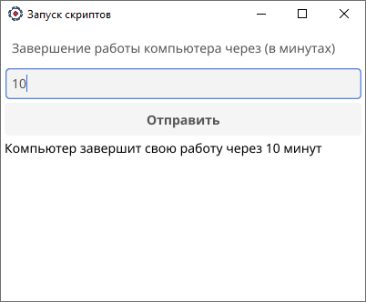

# go-fyne

go-fyne - проект (desktop приложение) для удобного запуска .bat файлов. Структура проекта Go + Fyne.

Основной функционал приложения:

* отложенное выключение компьютера.



### Запуск

```shell
make run
```

### Сборка проекта под Windows

```shell
make build-windows
```